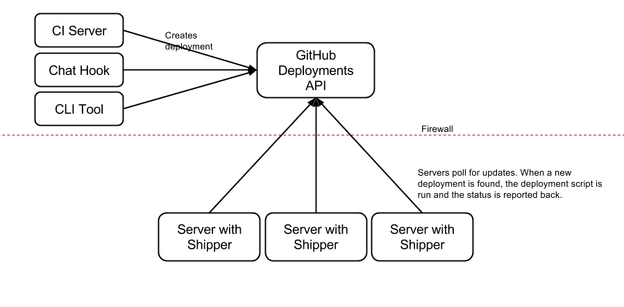

## Jack the Shipper

Shipper is a continuous deployment tool that leverages GitHub's [Deployments API](https://developer.github.com/v3/repos/deployments/) to allow secure asyncronous deployments.

### How does it work?

A shipper daemon polls the Github Deployments API for new deployments on a given environment. When a new deployment is found it follows these steps:

- Creates a "pending" Github Deployment Status
- Checks out the code into a "versioned" folder
- Runs the "Before Symlink" steps
- Creates a symbolic link called `current` to the new check out
- Runs the "After Symlink" steps
- Creates a "success" Github Deployment Status

Here is a diagram of how the whole system might look like:

### Configuration

A configuration file is required to set up shipper. It uses the yaml format and it should contain the following parameters:

- `git_url`: The url of the Github repository
- `environment`: The environment the daemon should check for new deployments
- `app_path`: Path of the application
- `server_id`: A unique ID for the server
- `before_symlink`: Array of commands to run before the symlink
- `after_symlink`: Array of commands to run after the symlink
- `shared_files`: A list of shared files to be symlinked

A `GH_KEY` environment variable with a [Github Oauth Token](https://help.github.com/articles/creating-an-access-token-for-command-line-use/) is currently required to run shipper.
This requirement will be removed for the monitor.

### Commands

#### Setup

Setup the folder structure within the `app_path`. It creates a `releases` and a `shared` folder.

`shipper setup -c shipper.yml`

#### New

Crease a new deployment in the Github API. A `ref` is required.

`shipper new -c shipper.yml --ref master`

#### Run

Run the process that continuously monitors for new deployments.

`shipper run -c shipper.yml`

### License

The template itself is available under the "Simplified" BSD license and can be
freely modified under the terms of that license. You can see the 
[full license text](https://github.com/dlapiduz/fabistrano/blob/master/LICENSE>)
in the Github repository for additional detail.

Applications created using this template are not considered derivatives works.
Applications created using this template can be freely licensed under whatever
you as the author chooses. They may be either open or closed source.
